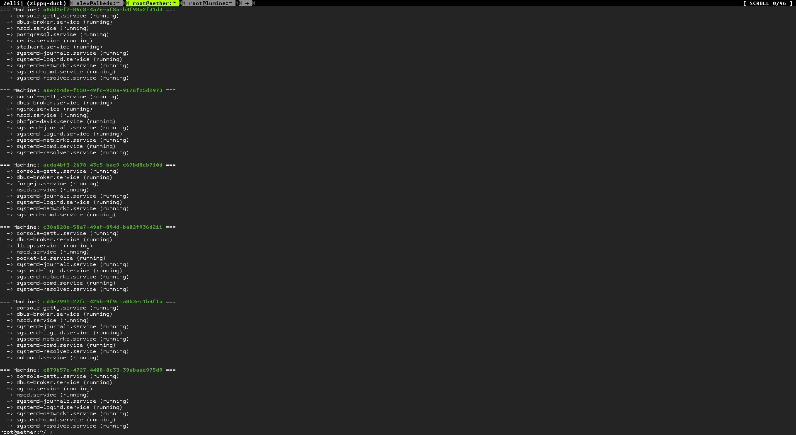
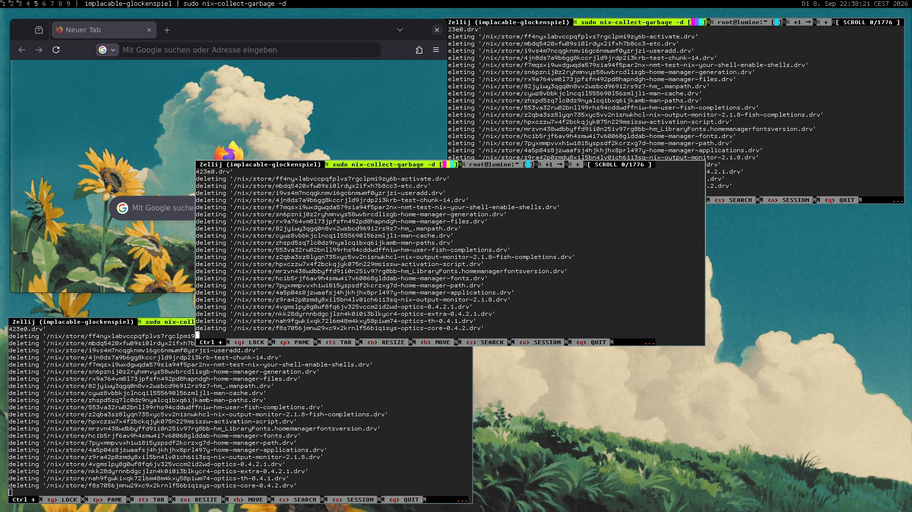
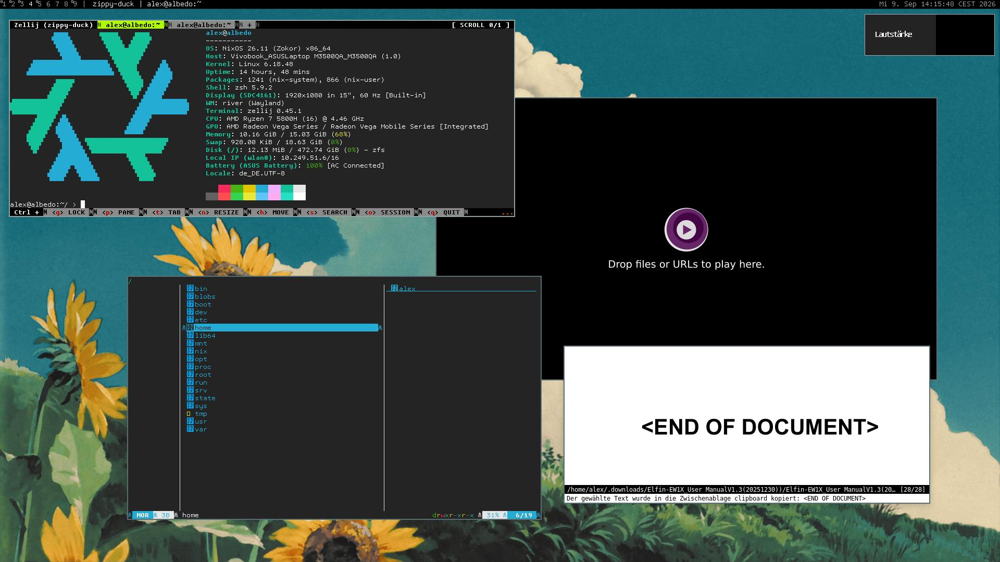
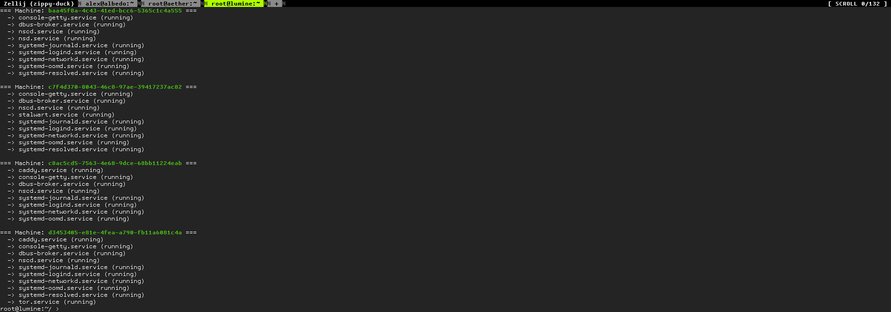

<!-- -->
# Reproducible configuration for Aether (Server), Albedo (Laptop) and Lumine (VPS).

> [!NOTE]
> Mirrors exist on [Codeberg](https://codeberg.org/alexandrutocar/config) and [GitHub](https://github.com/alexandrutocar/config). Issue tracking, milestone planning, and pull requests all take place on a private [Forgejo](https://forgejo.org) instance.

The contained configuration is opinionated and works for me. It introduces its own conventions (e.g. `import = recursive <...>`) and systems (e.g. `services.sigil`), so be warned. If anything overly strange takes place, it is usually explained inline. If it is not, then try looking up the definition – either inside this repository, [home-manager](https://github.com/nix-community/home-manager) or [nixpkgs](https://github.com/nixos/nixpkgs) repositories. If you've exhausted all options and still have questions, or if you would like to share your thoughts – feel free to reach out on social media or [via email](mailto:alexandru.tocar@outlook.com).

- [Reproducible configuration for Aether (Server), Albedo (Laptop) and Lumine (VPS).](#reproducible-configuration-for-aether-server-albedo-laptop-and-lumine-vps)
  - [Screenshots](#screenshots)
    - [Aether](#aether)
    - [Albedo](#albedo)
    - [Lumine](#lumine)
  - [Deployment](#deployment)
  - [Structure](#structure)
  - [Genesis](#genesis)

## Screenshots

### Aether



### Albedo





### Lumine



## Deployment

Usual nix tooling is used for building, testing and deploying host configuration.

```
nixos-rebuild build --flake .#<host> --target-host root@<host>.hosts.net.internal --build-host root@aether.hosts.net.internal --show-trace 2>&1 | tee trace.log
```

```
nixos-rebuild test --flake .#<host> --target-host root@<host>.hosts.net.internal --build-host root@aether.hosts.net.internal --show-trace 2>&1 | tee trace.log
```

```
nixos-rebuild switch --flake .#<host> --target-host root@<host>.hosts.net.internal --build-host root@aether.hosts.net.internal --show-trace 2>&1 | tee trace.log
```

> [!NOTE]
> When [Aether](./etc/aether/) is down or unreachable, a different build-host can be specified instead. In some cases, the builders list should be reset with `--builders ''`.

In case a test does not go to plan, it can be reverted to previous configuration if 

## Structure

```nix
|____doc
|____dot
| |____<host>
|   |____by-user
|     |____<user>
|       |____default.nix
|____etc
| |____<host>
|   |______config
|   |____default.nix
|   |____report.json # <- facter's report
|____nix
  |____dev-shell
  | |____default.nix
  |____fixes? # <- package fixes
  |____hm # <- updated and new modules for Home Manager
  |____lib # <- lib(s) updates and .extra lib 
  |____nixos # <- updated and new modules for NixOS
  |____packages # <- new packages
```

Configuration is commonly indexed (e.g. `01-development`) or organised by category (e.g. `by-user`). Directories and files prefixed with an underscore (e.g. `_config`) are usually excluded from being imported recursively. Large configuration files are avoided whenever possible. Clarity is central, but, wherever it is fitting, convention is preferred.

## Genesis

Configuring your system using the Nix programming language is a choice. Using a convention is a choice. Flakes are a choice. Sometimes, with such a grand landscape and ambiguous trade-offs, deciding gets difficult.

I got lost countless times and found my way out of the paralysis of indecision through belief, intuition and, if things are not as I imagined them to be, acceptance. In software, especially where established best practices are scarce or nonexistent, this is common. Configuration is particularly special because it's fundamentally meta-programming: you generate files and run commands. There are countless ways to configure the multitude of services, programs, and systems. Conventions layer upon conventions, and different approaches overlap. Rather than guiding you, they may stall you – but never stop you. 

Sometimes it is about the things you learn along the way and not about the result. Sometimes it's about you and your opinion, sometimes you listen to others' opinions. Along the way, I encountered countless software manifestos that shaped my approach to writing configuration. Here are a few of them:  

- [The Brutalist Programming Manifesto](http://www.call-with-current-continuation.org/articles/brutalist-manifesto.txt)
- [Suckless Philosophy](https://suckless.org/philosophy/)
- [Malleable Software and Systems](https://malleable.systems/mission/)

Your configuration will always change and never remain static, because nothing in software is set in stone.