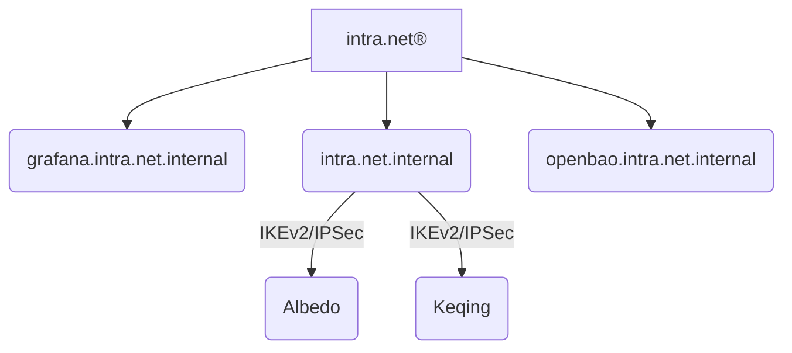

<!-- spell-checker: ignore cfssl cfssljson initca -->
# Certs

Contains PKI certificates for the local private network (codenamed `intra.net`).

## Hierarchy



## Operation

### Authority

To generate an anchor certificate: 

```bash
cfssl gencert -initca anchor/intra.net.jsonc | cfssljson -bare anchor/intra.net
```

### Consumers

To generate (and sign) a client certificate:

```bash
cfssl gencert -ca anchor/intra.net.pem -ca-key anchor/intra.net-key.pem -config profiles.jsonc -profile client client/[name].jsonc | cfssljson -bare client/[name]
```

To generate (and sign) a server certificate:

```bash
cfssl gencert -ca anchor/intra.net.pem -ca-key anchor/intra.net-key.pem -config profiles.jsonc -profile server server/[name].jsonc | cfssljson -bare server/[name]
```

## Quick Actions

### How to delete previously generated certificates and signing requests?

```sh
find . -type f \( -name \*.pem -o -name \*.csr \) -delete
```